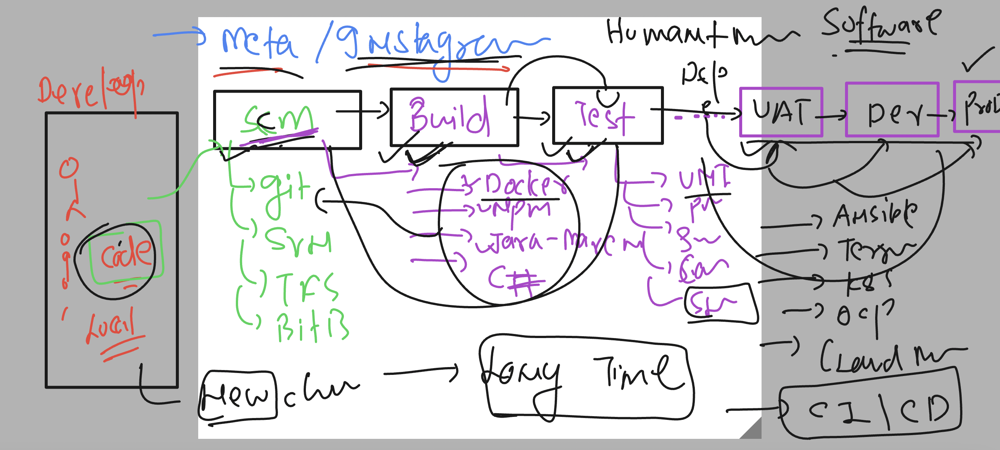
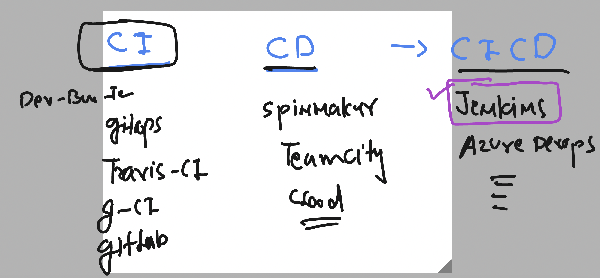
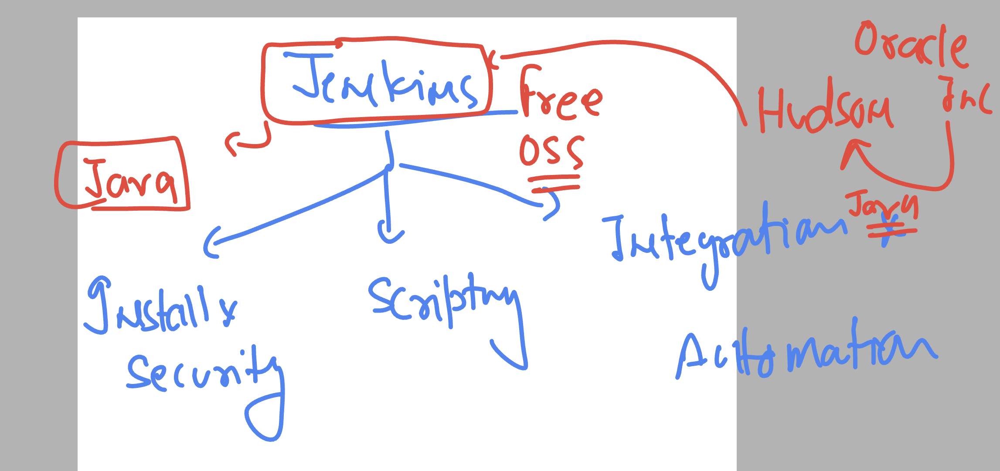

# cloud4c-cicdb4

### Understanding the NEED of CICD tools 



### cicd tools 


### abit more info about Jenkins 



### allow aws firewall for your lab connect


## Installing jenkins on linux -- machine -- Redhat linux 

### updating software repo 

```
[ec2-user@ip-172-31-1-174 ~]$ sudo yum update 
Failed to set locale, defaulting to C
Loaded plugins: extras_suggestions, langpacks, priorities, update-motd
amzn2-core                                                                                                                            | 3.7 kB  00:00:00     
Resolving Dependencies
--> Running transaction check
---> Package elfutils-default-yama-scope.noarch 0:0.176-2.amzn2 will be updated
---> Package elfutils-default-yama-scope.noarch 0:0.176-2.amzn2.0.1 will be an update
---> Package elfutils-libelf.x86_64 0:0.176-2.amzn2 will be updated
---> Package elfutils-libelf.x86_64 0:0.176-2.amzn2.0.1 will be an update
---> Package elfutils-libs.x86_64 0:0.176-2.amzn2 will be updated

```

### adding jenkins software repo 

```
sudo wget -O /etc/yum.repos.d/jenkins.repo \
>     https://pkg.jenkins.io/redhat-stable/jenkins.repo
```

### update key license 

```
sudo rpm --import https://pkg.jenkins.io/redhat-stable/jenkins.io-2023.key
```

### installing jdk 11

```
sudo amazon-linux-extras install java-openjdk11 -y
```

### installing jenkins 

```
sudo yum install jenkins -y
```

### start 

```
[ec2-user@ip-172-31-1-174 ~]$ sudo systemctl enable jenkins
Created symlink from /etc/systemd/system/multi-user.target.wants/jenkins.service to /usr/lib/systemd/system/jenkins.service.
[ec2-user@ip-172-31-1-174 ~]$ sudo systemctl start jenkins
```

