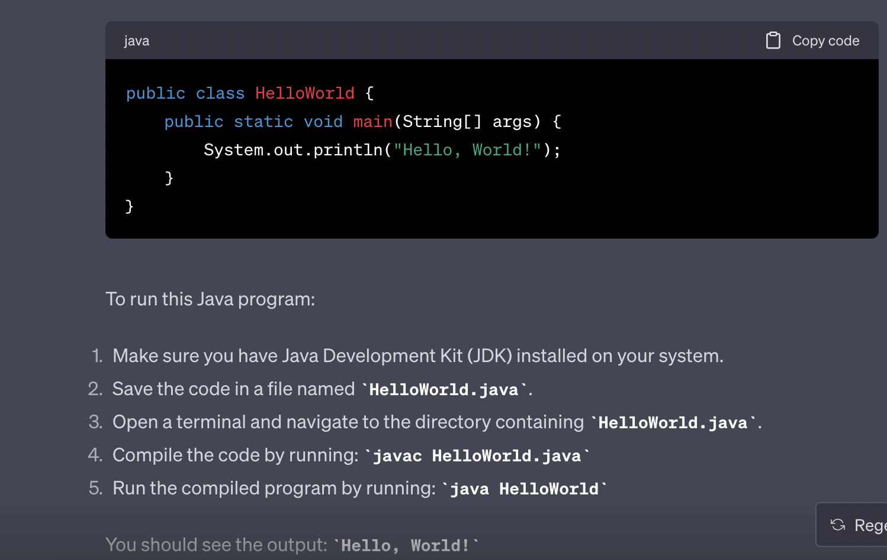

# cloud4c-cicdb4

### checking jenkins status

```
[ec2-user@ip-172-31-1-174 ~]$ sudo systemctl status jenkins 
● jenkins.service - Jenkins Continuous Integration Server
   Loaded: loaded (/usr/lib/systemd/system/jenkins.service; enabled; vendor preset: disabled)
   Active: active (running) since Wed 2023-08-16 11:41:47 UTC; 14min ago
 Main PID: 3047 (java)
   CGroup: /system.slice/jenkins.service
           └─3047 /usr/bin/java -Dj
```

### Understanding jenkins role -- 


### jobs in jenkins -- set of instruction 


### creating job and configuration steps 


### after job configuration we have -- steps 


### running a job and understanding it 


### understanding integration 


### By default jenkins is not integrated with Github 


### Installing git on the server where jenkins is running 

```
sudo yum install git -y 
```

### java code using jenkins 



### Installing docker on jenkins server

```
 23  sudo  yum install docker -y
   24  history 
[ec2-user@ip-172-31-1-174 ~]$ sudo systemctl enable docker 
Created symlink from /etc/systemd/system/multi-user.target.wants/docker.service to /usr/lib/systemd/system/docker.service.
[ec2-user@ip-172-31-1-174 ~]$ sudo systemctl start  docker 
[ec2-user@ip-172-31-1-174 ~]$ sudo systemctl status   docker 
● docker.service - Docker Application Container Engine
   Loaded: loaded (/usr/lib/systemd/system/docker.service; enabled; vendor preset: disabled)
   Active: active (running) since Wed 2023-08-16 13:26:37 UTC; 5s ago
     Docs: https://docs.docker.com

```
