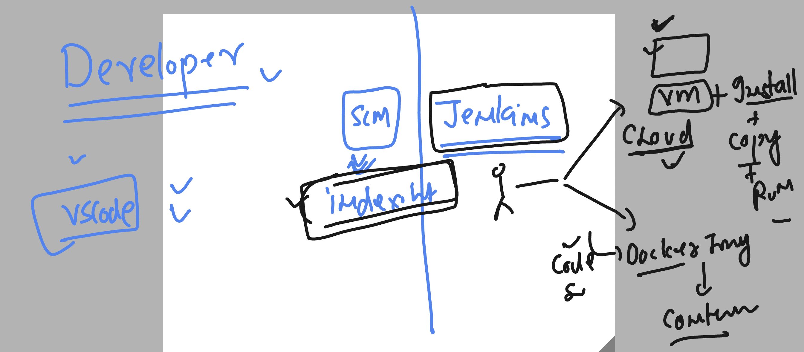
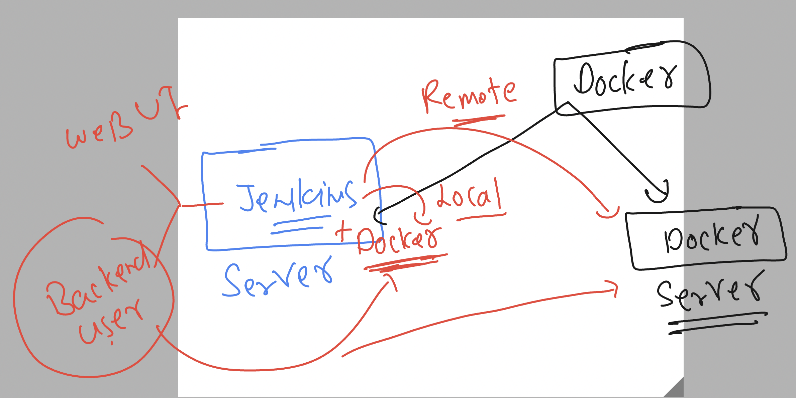

# cloud4c-cicdb4

### Jenkins from Now 


### things to do -- to run code / app 



### jenkins with docker integration 



### Installing docker in the same machine where jenkins is running

```
sudo yum install docker -y
```

### starting docker 

```
[ec2-user@ip-172-31-7-110 ~]$ sudo systemctl enable docker
Created symlink from /etc/systemd/system/multi-user.target.wants/docker.service to /usr/lib/systemd/system/docker.service.
[ec2-user@ip-172-31-7-110 ~]$ sudo systemctl start docker
[ec2-user@ip-172-31-7-110 ~]$ sudo systemctl status docker
● docker.service - Docker Application Container Engine
   Loaded: loaded (/usr/lib/systemd/system/docker.service; enabled; vendor preset: disabled)
   Active: active (running) since Thu 2023-08-17 12:10:39 UTC; 4s ago
     Docs: https://docs.docker.com
```

### giving permission to the use currently 

```
sudo chmod 777  /var/run/docker.sock
```

### permanent solution 

```
sudo usermod -aG docker  jenkins
```

