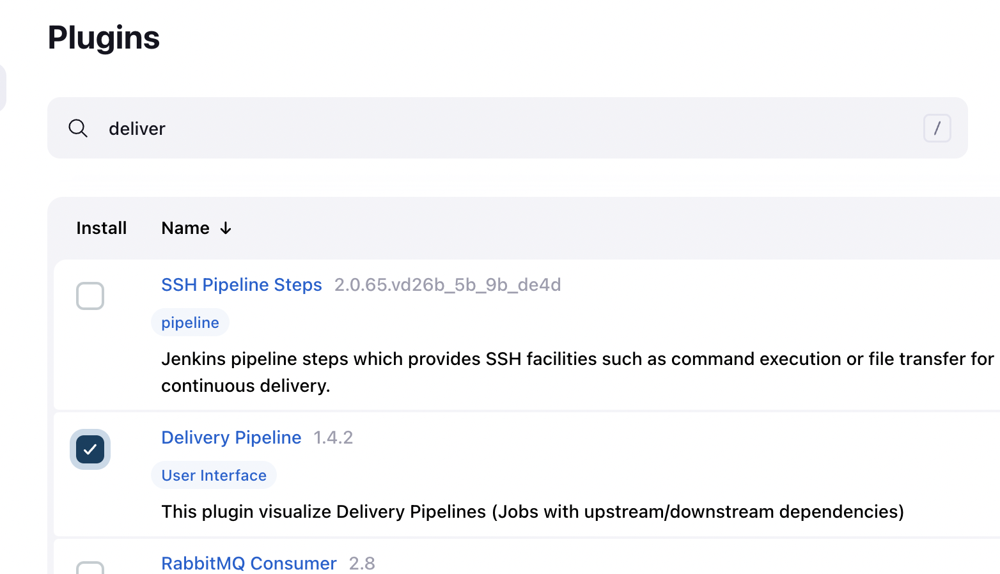

# cloud4c-cicdb4

### build and testing understanding 


### pipeline jobs 


### pipeline plugins 



## app jenkins data

### index.html 

```

<!DOCTYPE html>
<html lang="en">
<head>
    <meta charset="UTF-8">
    <meta name="viewport" content="width=device-width, initial-scale=1.0">
    <title>ashu-webapp</title>
</head>
<body>
   <h1> hello world </h1>
    <h2> I m ashutoshh SIngh trying to write code </h2>
    <p> updating docker image version tag </p>
    <b> Showing jenkins image </b>
    

</body>
</html>
```

### health.html 

```
<!DOCTYPE html>
<html lang="en">
<head>
    <meta charset="UTF-8">
    <meta name="viewport" content="width=device-width, initial-scale=1.0">
    <title>health</title>
</head>
<body>
    <h1> Just for checking health of HTTP request</h1>
    
</body>
</html>
```

### .dockerignore

```
Dockerfile
docker-compose.yaml
.dockerignore
```

### Dockerfile

```
FROM nginx
LABEL name="ashutoshh singh"
COPY . /usr/share/nginx/html/
EXPOSE 80
```

### docker-compose.yaml

```
version: '3.8'
services: # app components like ui , logs , db 
  ashu-ui-service:
    image: ashu-webui:version$BUILD_NUMBER 
    build:
      context: . # location of dockerfile 
      dockerfile: Dockerfile  # name of Dockerfile 
    container_name: ashu-web-c1 # name of container 
    ports:
      - 1234:80 # you can use 1024-5000 range 
```

### changing executors 


```
[root@ip-172-31-7-110 ~]# cd  /var/lib/jenkins/
[root@ip-172-31-7-110 jenkins]# ls
%C                              jenkins.install.InstallUtil.lastExecVersion     logs              queue.xml.bak             userContent
config.xml                      jenkins.install.UpgradeWizard.state             nodeMonitors.xml  secret.key                users
hudson.model.UpdateCenter.xml   jenkins.model.JenkinsLocationConfiguration.xml  nodes             secret.key.not-so-secret  workspace
hudson.plugins.git.GitTool.xml  jenkins.telemetry.Correlator.xml                plugins           secrets
identity.key.enc                jobs                                            queue.xml         updates
[root@ip-172-31-7-110 jenkins]# 
[root@ip-172-31-7-110 jenkins]# cd jobs/
[root@ip-172-31-7-110 jobs]# ls
Mogal-Jenkins1         hari-app-testing          haritha-docker   mahesh_new_task_day4       sakruthi-docker-test  saritha-app-tesing-job1  siva-docker-test
ashu-app-testing-job1  hari-docker               mahesh-docker    mogal-testapp              sanka-jenkins-webapp  saritha-docker
ashu-docker-test       haritha-app-testing-job1  mahesh-pipeline  sakruthi-app-testing-job1  sankar-testapp        siva-app-testing-job1
[root@ip-172-31-7-110 jobs]# cd ../workspace/
[root@ip-172-31-7-110 workspace]# ls
Mogal-Jenkins1         hari-docker               mahesh_new_task_day4       sanka-jenkins-webapp     sia-docker-test
ashu-app-testing-job1  haritha-app-testing-job1  mogal-testapp              sankar-testapp           siva-app-testing-job1
ashu-docker-test       haritha-docker            sakruthi-app-testing-job1  saritha-app-tesing-job1  siva-docker-test
hari-app-testing       mahesh-docker             sakruthi-docker-test       saritha-docker
[root@ip-172-31-7-110 workspace]# cd ..
[root@ip-172-31-7-110 jenkins]# ls
%C                              jenkins.install.InstallUtil.lastExecVersion     logs              queue.xml.bak             userContent
config.xml                      jenkins.install.UpgradeWizard.state             nodeMonitors.xml  secret.key                users
hudson.model.UpdateCenter.xml   jenkins.model.JenkinsLocationConfiguration.xml  nodes             secret.key.not-so-secret  workspace
hudson.plugins.git.GitTool.xml  jenkins.telemetry.Correlator.xml                plugins           secrets
identity.key.enc                jobs                                            queue.xml         updates
[root@ip-172-31-7-110 jenkins]# vim config.xml 
[root@ip-172-31-7-110 jenkins]# systemctl reload jenkins
Failed to reload jenkins.service: Job type reload is not applicable for unit jenkins.service.
See system logs and 'systemctl status jenkins.service' for details.
[root@ip-172-31-7-110 jenkins]# systemctl restart jenkins
[root@ip-172-31-7-110 jenkins]# systemctl status jenkins
● jenkins.service - Jenkins Continuous Integration Server
   Loaded: loaded (/usr/lib/systemd/system/jenkins.service; enabled; vendor preset: disabled)
   Active: active (running) since Fri 2023-08-18 13:21:00 UTC; 6s ago
 Main PID: 7096 (java)
    Tasks: 57
   Memory: 1.2G
   CGroup: /system.slice/jenkins.service
           └─7096 /usr/bin/java -Djava.awt.headless=true -jar /usr/share/java/jenkins.war --webroot=%C/jenkins/war --httpPort=8080

Aug 18 13:20:59 ip-172-31-7-110.us-east-2.compute.internal je
```


