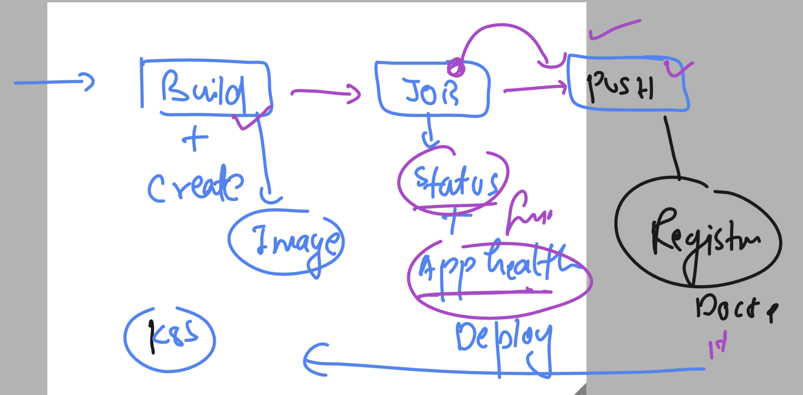
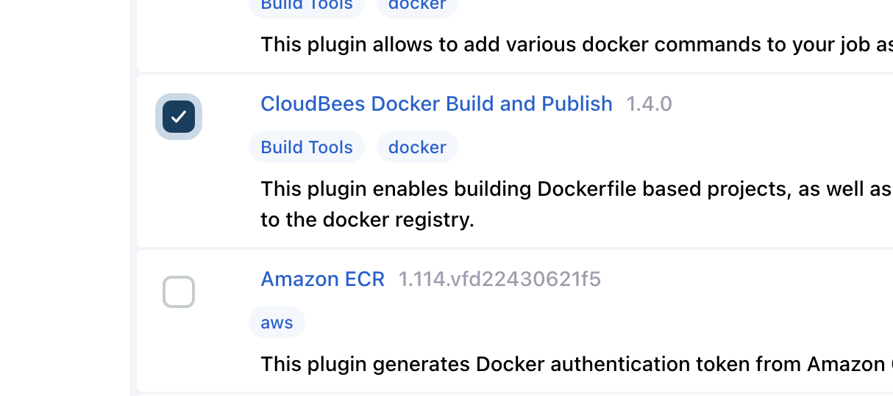
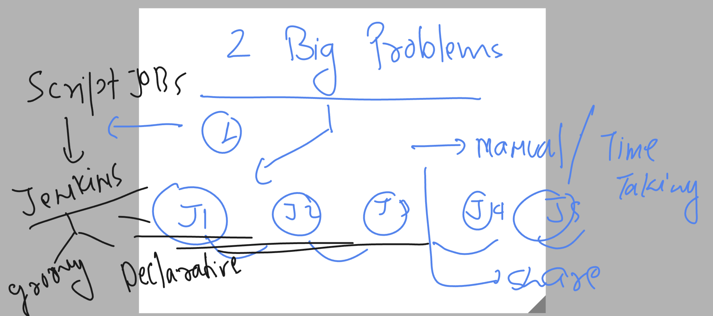
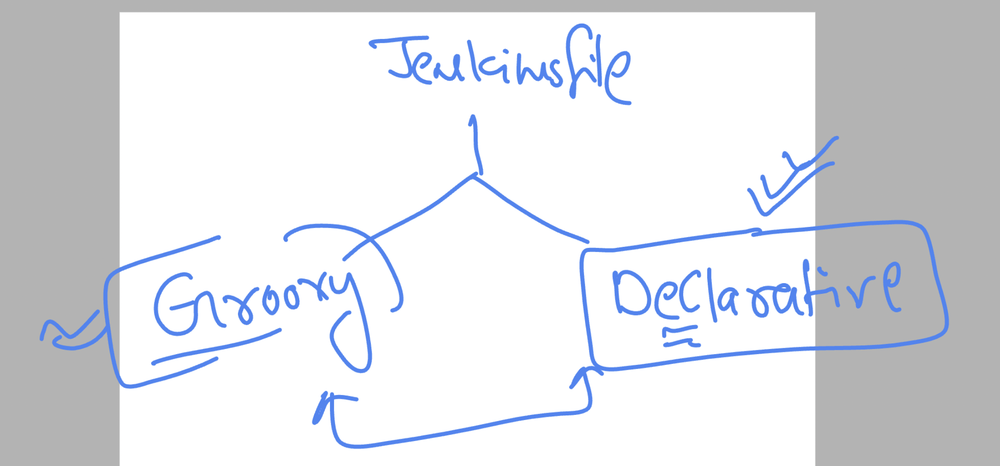
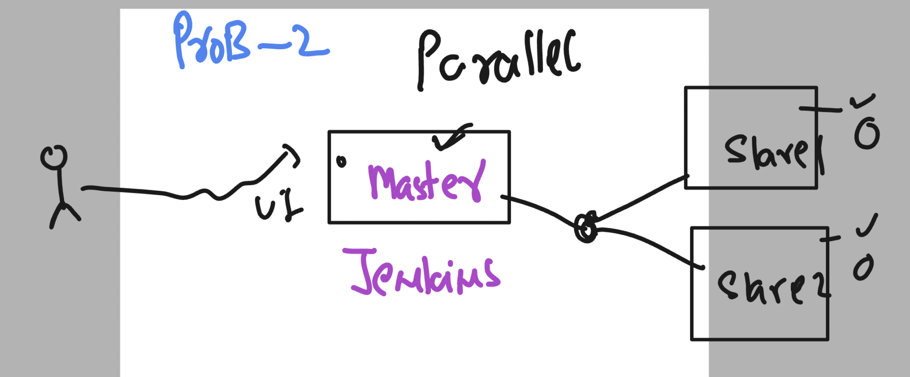

# cloud4c-cicdb4

### in the process of CI -- we are not pushing image to docker hub 



### jenkins plugins for pushing image to registry (Docker hub)



### introduction to jenkinsfile concept 



### jenkinsfile options



### concept of jenkins cluster 



### pipeline job 

```
pipeline  {
    agent any // jenkins master will automatically decide where to run jobs
    stages {
        stage('printing message') {
            steps {
                echo 'Hello world this is jenkinsfile'
            }
            
        }
        stage('checking current time') {
            steps {
                sh 'date'
            }
            
        }
        
        stage('checking calendar') {
            steps {
                sh 'cal'
            }
        }
        
    }
}
```
