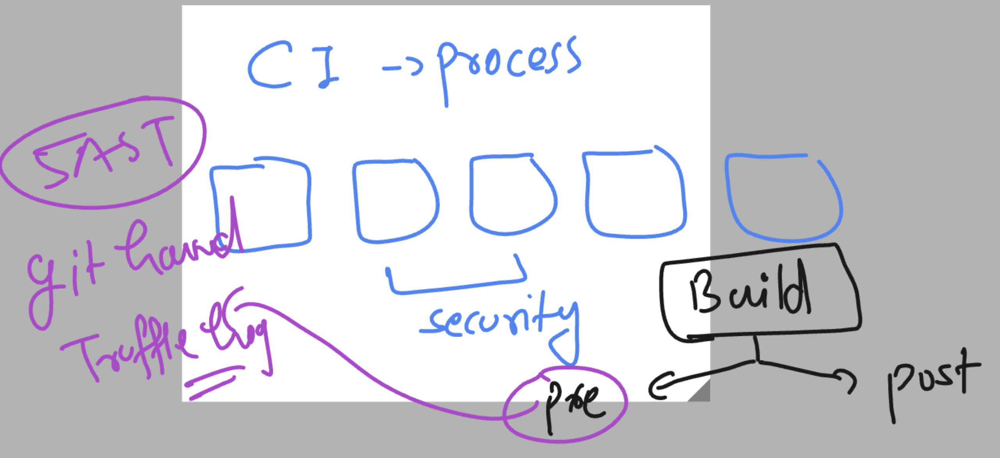

# cloud4c-cicdb4
### implement security in jenkins pipeline 



### adding security scaning prebuild using docker -- trufflehog 

```
pipeline {
    agent {
        label 'mymaster'
    } // any node can build job either master or slave 

    stages {
        stage('taking code from github and verify it') {
            steps {
                echo 'cloning code from github' // echo is predefine keyword
                git branch: 'master',
                    url: 'https://github.com/redashu/ashu-webapp-project.git' // taking source code 
                // verify all the data 
                sh 'ls -a'
            }
        }
        // SAST tool trufflehog for scanning code 
        stage('prebuild security scanning'){
            agent {
                label 'slave1'
            }
            steps {
                echo 'using docker based trufflehog to scan code'
                sh 'docker run --rm trufflesecurity/trufflehog:latest   github --repo https://github.com/redashu/ashu-webapp-project.git >/tmp/ashu1.txt'
                sh 'cat /tmp/ashu1.txt | grep -Eiw "private|key" && exit 1'
            }
        }
        // use docker-compose for build and run purpsoe 
        stage('using docker compose'){
            steps {
                echo 'using docker compose to manage'
                sh 'docker-compose down'
                sh 'docker-compose up -d --build'
                sh 'docker-compose ps'
                sh 'docker-compose images'
            }
        }
        // verify container status and check health page
        stage('using testing'){
            steps {
                echo 'checking container running status'
                sh 'docker ps | grep -w Up | grep -w ashu-web-c2'
                sh 'curl -f http://localhost:1235/health.html'
            }
        }
        stage('jenkinsfile way to build docker image'){
            steps {
                echo 'using jenkinsfile method'
                script {
                    def ashuImg = "dockerashu/ashu-webui-cloud4c" // creating variables to store data
                    def ashuTag = "version$BUILD_NUMBER"
                    // using docker pluing to build image
                    docker.build(ashuImg + ":" +ashuTag, ".")
                }
                // verify image build
                sh 'docker images | grep ashu-webui-cloud4c'
            }
        }
        stage('pushing image to dockerhub'){
            steps {
                echo 'using jenkins plugins to push image'
                script {
                    def ashuImg = "dockerashu/ashu-webui-cloud4c"
                    def ashuTag = "version$BUILD_NUMBER"
                    def ashuCred = "6b9dcaf6-74ca-45d9-a0ca-f0a4108d816a"
                    // login to docker hub
                    docker.withRegistry('https://registry.hub.docker.com',ashuCred){
                        // pushing image 
                        docker.image(ashuImg + ":" + ashuTag).push()
                    }
                }
            }
        }
    }
}

```
